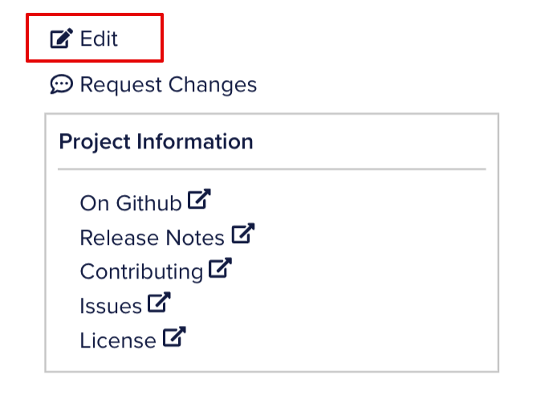
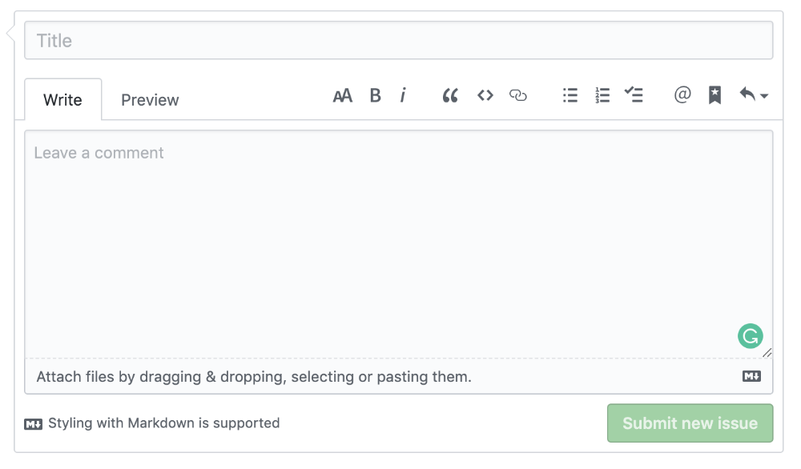
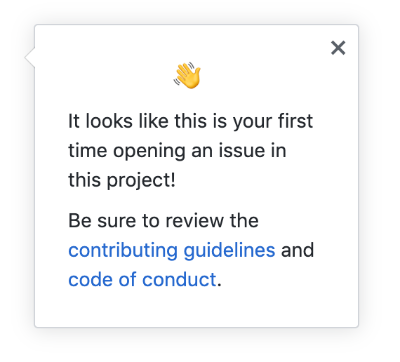

---
tags:
  - eosnetworkfoundation/docs/tree/main/docs/get-involved/index.md
  - eosnetworkfoundation/docs
  - main
title: Get Involved
sidebar_position: 10
---

We appreciate your interest in contributing to the Antelope framework! We always welcome contributions from our community to make our code and docs better.

* [Get Involved with Antelope Community and Code](#get-involved-with-eosio-code)
* [Get Involved with Antelope Documentation](#get-involved-with-eosio-documentation)

## Get Involved with Antelope Community and Code

The following are different ways you can get involved with the Antelope developers community and Antelope repositories. You can find repositories to contribute to in [software manuals](../manuals) and on the [Antelope Organization](https://github.com/AntelopeIO) on GitHub.

For more information about the contribution guidelines of a particular repository, look for the "Contributing" link in the right-hand sidebar of the documentation.


### Developers Community Involvement

#### Antelope Stack Exchange
Engage the Antelope developer community over [Antelope Stack Exchange](https://eosio.stackexchange.com/). You can ask a question related to Antelope or answer questions and share your Antelope knowledge with the community.

#### Antelope Developer Telegram
Instantly engage the Antelope developer community over [Antelope Telegram](https://t.me/joinchat/EaEnSUPktgfoI-XPfMYtcQ) instant messenger. Get involved by sharing your expertise in Antelope development discussions, sharing community tools and projects that can assist Antelope developers, and more.

### Get Involved with Antelope Code

Antelope is a large open source project with over 500 repositories for its stack and core components. You can visit the repositories in the [Antelope Organization](https://github.com/AntelopeIO) on Github and start contributing to the code base.

There are many ways you can contribute to Antelope code. You can report an issue, submit a pull request, and review pull requests.

### Reporting an Issue
If you're about to raise an issue because you think you've found a problem with the stack, or you'd like to make a request for a new feature in the codebase, or any other reason, please read this first.

The GitHub issue tracker is the preferred channel for bug reports, feature requests, and submitting pull requests, but please respect the following restrictions:

* Please **search for existing issues**. Help us keep duplicate issues to a minimum by checking to see if someone has already reported your problem or requested your idea.

* Please **be civil**. Keep the discussion on topic and respect the opinions of others. See our [Code of Conduct](#code-of-conduct).

#### Bug Reports

A bug is a _demonstrable problem_ that is caused by the code in the repository and can be reported in the form of a new issue.

Guidelines for bug reports:

1. **Use the GitHub issue search** &mdash; check if the issue has already been
   reported.

2. **Check if the issue has been fixed** &mdash; look for closed issues in the
   current milestone or try to reproduce it
   using the latest `develop` branch.

A good bug report or a new issue shouldn't leave others needing to chase you up for more information. Be sure to include the details of your environment and relevant tests that demonstrate the failure.

#### Feature Requests

Feature requests are welcome. Before you submit one be sure to have:

1. **Use the GitHub search** and check the feature hasn't already been requested.
1. Take a moment to think about whether your idea fits with the scope and aims of the project.
1. Remember, it's up to *you* to make a strong case to convince the project's leaders of the merits of this feature. Please provide as much detail and context as possible, this means explaining the use case and why it is likely to be common.

## Get Involved with Antelope Documentation

The Antelope documentation is written in Markdown. You can either submit a Pull Request for quick edits or file a new docs issue. For Markdown syntax usage, see the [Markdown Syntax Documentation](https://daringfireball.net/projects/markdown/syntax).

### Quick Edits
Quick edits allow for faster reporting of minor content issues from typographical errors to omissions.

Most of the pages on the Antelope developer portal provide an **Edit** link which redirects you to the source file on Github. If you don't see the **Edit** button on the documentation page, that means the specific page is not available to be changed.

To make a quick edit:

1. Go to the specific page where you have identified an editorial need and click the **Edit** icon at the top right of the page.



2. Fork the repository to suggest changes. Click **Fork this repository**.


> If you are not signed in to your Github account, it will redirect you to the Github login page. Sign in with your username and password to continue. If you are new to Github, create a new account.


3. Make the suggested changes in the web editor using Markdown syntax. Click the **Preview changes** tab to see the preview of the content.
4. After suggesting your changes, scroll down to the bottom on the page. Enter a title and a description of the changes you made and click **Propose file change**.
5. Create a ***Pull Request*** by entering a title and a description. Click **Create pull request** to submit your suggestion to us.
   > If you are new to Github, see [About Pull Requests](https://help.github.com/en/github/collaborating-with-issues-and-pull-requests/about-pull-requests) for more information.

Congrats! You have submitted your suggestion. Our team will review your pull request and merge it if it's a valid change.


### Filing a Docs Issue
Filing an issue in a docs repository means reporting a documentation bug in the form of a Github issue.

To file a new issue:

1. Go to the specific page where you have identified an area of improvement and click **Request Changes** at the top right of the page.
   
2. You will be directed to the Issues tab of the specific repository with an editable Issue form.

   
   > If you are not signed in to your Github account, it will redirect you to the Github login page. Sign in with your username and password to continue. If you do not have a Github account, create a new account.
3. Enter the issue title and describe the issue with a proposed solution if you have using Markdown syntax.
   > If you are filing an issue for the first time, review the contributing guidelines of the repository.
   
4. Click **Submit new issue** to submit the issue to the repository.


## Code of Conduct

While contributing, please be respectful and constructive, so that participation in our project is a positive experience for everyone.

Examples of behavior that contributes to creating a positive environment include:
- Using welcoming and inclusive language
- Being respectful of differing viewpoints and experiences
- Gracefully accepting constructive criticism
- Focusing on what is best for the community
- Showing empathy towards other community members

Examples of unacceptable behavior include:
- The use of sexualized language or imagery and unwelcome sexual attention or advances
- Trolling, insulting/derogatory comments, and personal or political attacks
- Public or private harassment
- Publishing others’ private information, such as a physical or electronic address, without explicit permission
- Other conduct which could reasonably be considered inappropriate in a professional setting


## Contributor License & Acknowledgments

Whenever you make a contribution to this project, you license your contribution under the same terms as set out in [LICENSE](./LICENSE), and you represent and warrant that you have the right to license your contribution under those terms.  Whenever you make a contribution to this project, you also certify in the terms of the Developer’s Certificate of Origin set out below:

```
Developer Certificate of Origin
Version 1.1

Copyright (C) 2004, 2006 The Linux Foundation and its contributors.
1 Letterman Drive
Suite D4700
San Francisco, CA, 94129

Everyone is permitted to copy and distribute verbatim copies of this
license document, but changing it is not allowed.


Developer's Certificate of Origin 1.1

By making a contribution to this project, I certify that:

(a) The contribution was created in whole or in part by me and I
    have the right to submit it under the open source license
    indicated in the file; or

(b) The contribution is based upon previous work that, to the best
    of my knowledge, is covered under an appropriate open source
    license and I have the right under that license to submit that
    work with modifications, whether created in whole or in part
    by me, under the same open source license (unless I am
    permitted to submit under a different license), as indicated
    in the file; or

(c) The contribution was provided directly to me by some other
    person who certified (a), (b) or (c) and I have not modified
    it.

(d) I understand and agree that this project and the contribution
    are public and that a record of the contribution (including all
    personal information I submit with it, including my sign-off) is
    maintained indefinitely and may be redistributed consistent with
    this project or the open source license(s) involved.
```
